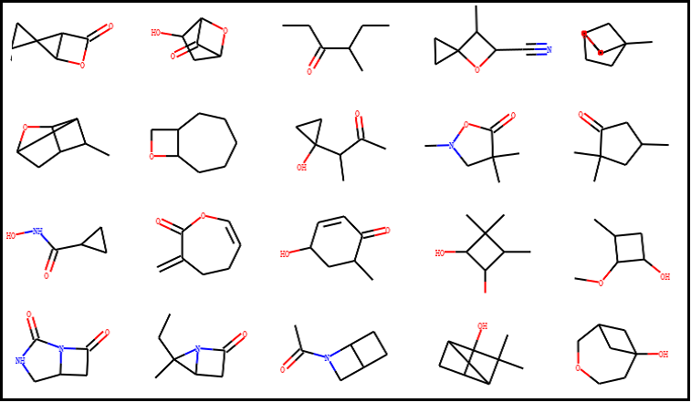

# Geometry-Aware Message Passing for Molecular Property Prediction

<p align="center">
  
</p>

This project compares three graph neural network architectures for molecular property prediction on the QM9 dataset, each incorporating 3D geometric information to a different degree. The goal is to study how geometric awareness affects predictive performance, robustness to noise, and resilience to topological bottlenecks in molecular graphs.

## Models

- **GIN**: Graph Isomorphism Network. Uses only molecular topology (node features and covalent bond connectivity). No access to 3D coordinates. Serves as the topological baseline.
- **GINDist**: GIN augmented with interatomic distances. Computes squared Euclidean distances between bonded atoms and concatenates them with bond-type features as edge attributes. E(3)-invariant but not equivariant.
- **EGNN**: E(n) Equivariant Graph Neural Network (Satorras et al., ICML 2021). Updates both node features and atomic coordinates at each message-passing layer. Maintains full E(3) equivariance through direction-vector-based coordinate updates.

## Target Properties

The models are trained jointly on four molecular properties from QM9, chosen to span a range of geometric dependence:

| Property | Symbol | Description | Geometric dependence |
|---|---|---|---|
| Dipole moment | mu | Separation of positive and negative charges | Medium |
| Polarizability | alpha | Deformability of the electron cloud | High |
| HOMO-LUMO gap | gap | Energy difference between frontier orbitals | Low |
| Heat capacity | Cv | Energy required to raise temperature at constant volume | High |

## Project Structure

```
molecular_prediction/
├── configs/
│   └── config.py                  # Dataclass-based configuration
├── src/molecular_prediction/
│   ├── data/
│   │   ├── dataset.py             # QM9 loading, splitting, normalisation
│   │   └── transforms.py          # NormaliseTargets, AddGaussianNoise
│   ├── models/
│   │   ├── base.py                # Abstract base class for all GNNs
│   │   ├── gin.py                 # GIN implementation
│   │   ├── gin_dist.py            # GINDist implementation
│   │   └── egnn.py                # EGNN implementation
│   ├── training/
│   │   ├── trainer.py             # Training loop, evaluation, checkpointing
│   │   ├── early_stopping.py      # Early stopping logic
│   │   ├── metrics.py             # Per-target MAE computation
│   │   └── utils.py               # Checkpoint saving utilities
│   └── experiments/
│       ├── main_comparison.py     # Training and evaluation of all models
│       ├── noise_ablation.py      # Noise robustness experiment
│       ├── per_molecule_eval.py   # Per-molecule MAE with denormalisation
│       └── curvature_analysis.py  # Ollivier-Ricci curvature analysis
├── main.py                        # Entry point for all experiments
├── models/                        # Saved model checkpoints
├── results/                       # JSON results files
├── images/                        # Generated plots
└── runs/                          # TensorBoard logs
```

## Setup

### Requirements

- Python 3.11+
- PyTorch 2.8.0+
- PyTorch Geometric 2.7.0+
- POT (Python Optimal Transport)
- NetworkX
- Matplotlib
- TensorBoard

### Installation

```bash
git clone <repository-url>
cd molecular_prediction
uv sync
```

The QM9 dataset is downloaded automatically on the first run.

## Experiments

The project includes three experiments, each runnable from the command line.

### Main Comparison

Trains all three models (GIN, GINDist, EGNN) on the QM9 dataset with identical hyperparameters and evaluates them on the test set. Produces training curves, per-target validation curves, and test MAE bar charts.

```bash
python main.py --experiment main_comparison --device cuda
```

Outputs:
- Model checkpoints in `models/`
- Training curves in `images/`
- Test MAE comparison plots in `images/`
- Numerical results in `results/comparison_results.json`
- TensorBoard logs in `runs/`

### Noise Ablation

Evaluates the pretrained models on test sets with increasing levels of Gaussian noise added to atomic coordinates. No retraining is performed. This experiment measures how each architecture's use of geometric information affects its sensitivity to coordinate perturbations. GIN serves as a control since it does not use coordinates.

```bash
python main.py --experiment noise_ablation --device cuda
```

Noise levels: sigma = 0.0, 0.1, 0.25, 0.5, 1.0 angstrom.

Outputs:
- Combined and per-target noise ablation curves in `images/`
- Numerical results in `results/noise_ablation_results.json`

### Curvature Analysis

Performs an analysis of over-squashing using Ollivier-Ricci curvature. For each molecule in the test set, computes the curvature of every edge in the covalent bond graph, assigns molecules to quartiles by minimum curvature (a representation of bottleneck severity), and compares model errors across quartiles. Tests whether the advantage of EGNN over GIN grows in molecules with more severe topological bottlenecks.

```bash
python main.py --experiment curvature_analysis --device cuda
```

Outputs:
- Curvature distribution plots in `images/`
- MAE by quartile plots (combined and per-target) in `images/`
- Relative improvement of EGNN over GIN by quartile in `images/`
- Numerical results in `results/curvature_analysis_results.json`

## Configuration

All hyperparameters are defined in `configs/config.py` using Python dataclasses:

| Parameter | Value |
|---|---|
| Hidden dimension | 128 |
| Message passing layers | 4 |
| Learning rate | 1e-3 |
| Batch size | 32 |
| Epochs | 150 |
| Scheduler | Cosine annealing |
| Train / Val / Test split | 110,000 / 10,000 / ~10,831 |

## References

- Satorras, V. G., Hoogeboom, E., & Welling, M. (2021). E(n) Equivariant Graph Neural Networks. ICML.
- Xu, K., Hu, W., Leskovec, J., & Jegelka, S. (2019). How Powerful are Graph Neural Networks? ICLR.
- Ramakrishnan, R., Dral, P. O., Rupp, M., & von Lilienfeld, O. A. (2014). Quantum chemistry structures and properties of 134 kilo molecules. Scientific Data.
- Topping, J., Di Giovanni, F., Chamberlain, B. P., Dong, X., & Bronstein, M. M. (2022). Understanding Over-Squashing and Bottlenecks on Graphs via Curvature. ICLR.
- Alon, U., & Yahav, E. (2021). On the Bottleneck of Graph Neural Networks and its Practical Implications. ICLR.

## Authorship

- Manuel Rodríguez Villegas (manuelrodriguez@alu.comillas.edu)